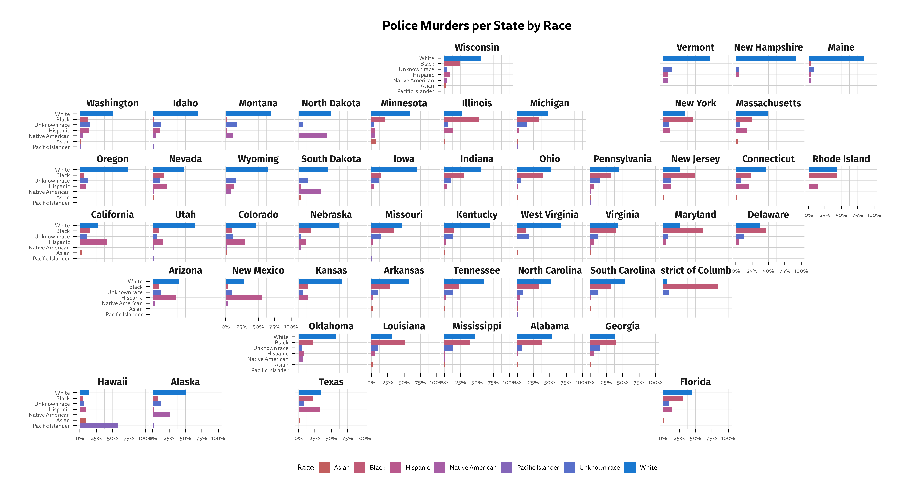
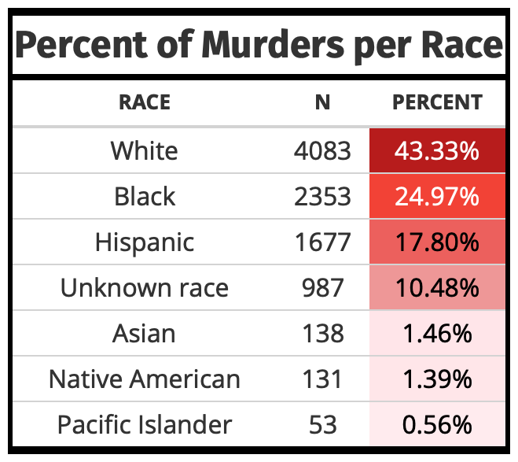

<!-- README.md is generated from README.Rmd. Please edit that file -->

```{r, include = FALSE}
knitr::opts_chunk$set(
  collapse = TRUE,
  warning = F,
  error = F,
  message = F,
  comment = "#>"
)
library(tidyverse)
library(readxl)
library(DGThemes)
library(geofacet)
library(gt)
```

# American Policing

<!-- badges: start -->
<!-- badges: end -->

The goal of the American Policing Project is to demonstrate the inefficacy and infefficiency of the American policing system.

A change that will only appear because of github actions.

An example visualization below:

```{r police, echo = F}
police <- readxl::read_excel("./raw.xlsx")
police_race <- police %>%
  count(`Victim's race`, State) %>%
  rename(race = 1) %>%
  group_by(State) %>%
  mutate(percent = 100*(n/sum(n))) %>%
  left_join(state_ranks %>% select(state, name), by = c("State" = "state")) %>%
  distinct(State, race, .keep_all = T) #%>%
  # mutate(name = str_replace_all(name, "District of Columbia", "DC"))
```

```{r eval = F}
ggplot(police_race, aes(fct_reorder(factor(race), percent), percent, fill = factor(race))) +
  geom_col() +
  scale_y_continuous(labels = scales::percent_format(scale = 1), limits = c(0, 100), breaks = c(0, 25, 50, 75, 100)) +
  coord_flip() +
  labs(title = "Police Murders per State by Race", x = "", y = "", fill = "Race") +
  theme_premium() +
  facet_geo( ~ name) +
  scale_fill_premium() +
  guides(fill = guide_legend(nrow = 1)) +
  theme(plot.title = element_text(hjust = 0.5, size = 18),
        legend.position = "bottom",
        axis.text.x = element_text(size = 8),
        axis.text.y = element_text(size = 8),
        panel.spacing = unit(0.1, "lines"),
        strip.text = element_text(face = "bold", family = "Fira Sans", hjust = 0.5, size = 14))
ggsave(here::here("Images/map_violence.png"), height = 10, width = 18, bg = "white")
```



An example table as well:

```{r pressure, echo = FALSE, eval = F}
police_race %>%
  group_by(race) %>%
  summarise(n = sum(n)) %>%
  mutate(percent = 100*n/sum(n)) %>%
  dplyr::arrange(dplyr::desc(percent)) %>%
  gt::gt() %>%
  gt::cols_label(
    race = "Race",
    n = "N",
    percent = "Percent"
  ) %>%
  gt::data_color(
    columns = percent,
    colors = scales::col_numeric(
      palette = paletteer::paletteer_d(
        palette = "ggsci::red_material"
        ) %>% as.character(),
      domain = NULL
      )
  ) %>%
  gt_theme_duncan(all_caps = T) %>%
  gt::tab_header(title = "Percent of Murders per Race") %>%
  gt::fmt_percent(columns = percent,
              scale_values = F, 
              decimals = 2) %>%
  gt::gtsave(here::here("Images/table.png"))
```

<div style="text-align:center">

</div>

In that case, don't forget to commit and push the resulting figure files, so they display on GitHub.
