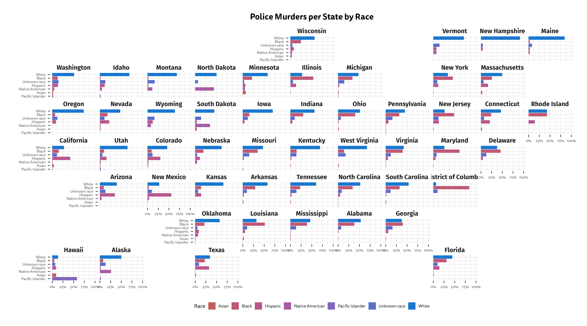
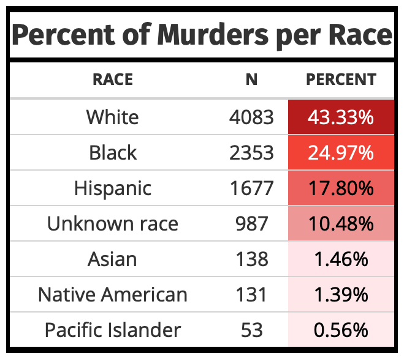

<!-- README.md is generated from README.Rmd. Please edit that file -->

# American Policing

<!-- badges: start -->
<!-- badges: end -->

The goal of the American Policing Project is to demonstrate the
inefficacy and infefficiency of the American policing system.

An example visualization below:

``` r
ggplot(police_race, aes(fct_reorder(factor(race), percent), percent, fill = factor(race))) +
  geom_col() +
  scale_y_continuous(labels = scales::percent_format(scale = 1), limits = c(0, 100), breaks = c(0, 25, 50, 75, 100)) +
  coord_flip() +
  labs(title = "Police Murders per State by Race", x = "", y = "", fill = "Race") +
  theme_premium() +
  facet_geo( ~ name) +
  scale_fill_premium() +
  guides(fill = guide_legend(nrow = 1)) +
  theme(plot.title = element_text(hjust = 0.5, size = 18),
        legend.position = "bottom",
        axis.text.x = element_text(size = 8),
        axis.text.y = element_text(size = 8),
        panel.spacing = unit(0.1, "lines"),
        strip.text = element_text(face = "bold", family = "Fira Sans", hjust = 0.5, size = 14))
ggsave(here::here("Images/map_violence.png"), height = 10, width = 18, bg = "white")
```



An example table as well:

<div style="text-align:center">



</div>

In that case, don’t forget to commit and push the resulting figure
files, so they display on GitHub.
